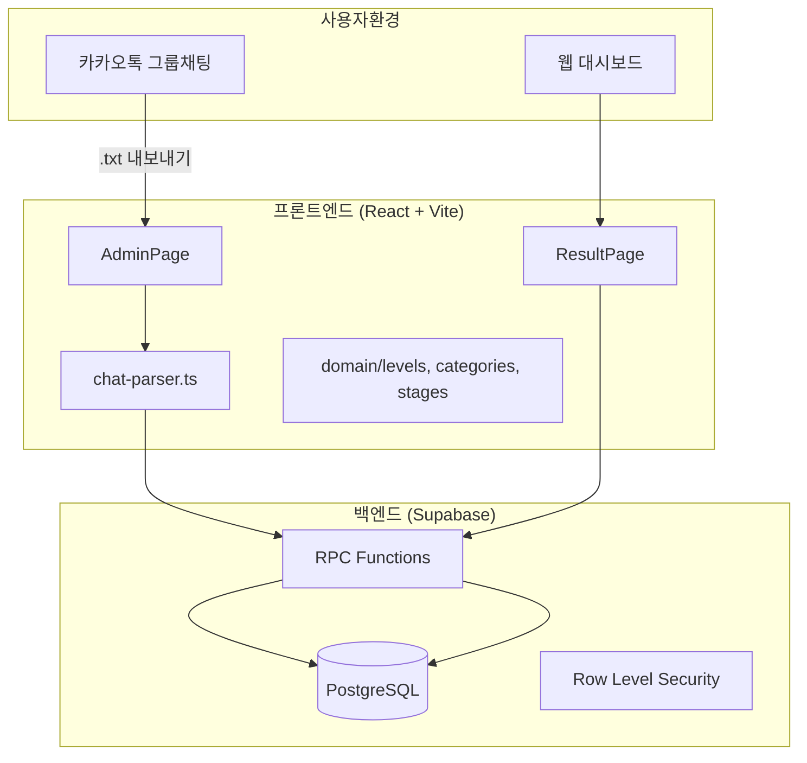
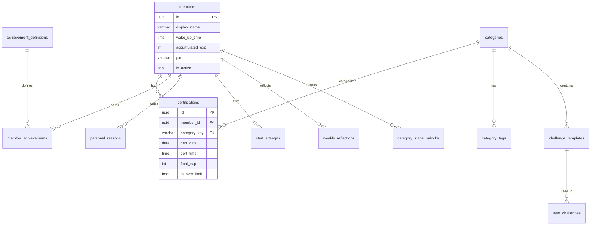

# 루루플 인증 레벨 시스템 V2 - 현재 시스템 기획서

> 작성일: 2026-10-03
> 분석 방법: 코드 정적 분석
> 버전: lurupl-v2-new

## 1. 시스템 정의와 개요

**이 시스템은 ADHD를 가진 사용자가 일상 활동의 실행 어려움을 해결하도록 카카오톡 기반 인증과 게이미피케이션(경험치/레벨/도전과제)을 제공하는 습관 형성 웹 애플리케이션이다.**

### 1.1 주요 이용자

| 역할 | 설명 | 권한 범위 |
|------|------|----------|
| 일반 멤버 | 카카오톡 그룹 채팅에서 해시태그로 인증하는 사용자 | 자신의 통계·도전과제 조회, 동기부여 허브 이용 |
| 운영자/관리자 | 인증 데이터를 업로드하고 시스템을 관리하는 사람 | 채팅 파일 업로드/파싱, 멤버 관리, 이벤트 설정 |

### 1.2 핵심 가치

- **즉각적 보상**: 인증할 때마다 EXP 획득 → 즉각적 성취감
- **장기 목표**: 레벨/등급/도전과제 → 지속적 동기부여
- **사회적 요소**: 월간 랭킹/수상 → 건강한 경쟁과 상호 격려
- **개인화 지원**: 동기부여 허브 → 나만의 이유와 작은 도전 관리

### 1.3 비유

> "루루플은 일상 활동을 위한 '피트니스 앱'과 같습니다. 운동 앱이 걸음 수를 추적하고 뱃지를 주듯, 루루플은 청소·운동·기상 등의 일상 인증을 추적하고 경험치와 레벨업을 제공합니다."

---

## 2. 사용자·운영자 이용 흐름

### 2.1 일반 멤버 이용 흐름

```
[카카오톡 그룹 채팅방에서]
1. 해시태그가 포함된 메시지 전송  예: "아침 청소 완료! #청소"

[시스템 처리]
2. 운영자가 채팅 파일(.txt)을 웹 관리자 페이지에 업로드
3. 클라이언트에서 chat-parser.ts가 메시지 파싱
4. 해시태그 → 카테고리 매칭, 중복·한도 검사
5. 운영자 확인 후 DB 저장

[결과 확인 - 웹 대시보드]
6. /result 페이지에서 월간 통계, 순위, 도전과제 확인
7. 자신의 이름 클릭 → 상세 프로필 모달
8. "내 정보" 탭 → PIN 인증 후 동기부여 허브 접근
```

**[코드 확인]** 흐름 전체가 `src/pages/ResultPage.tsx`, `src/domain/chat-parser.ts`, `supabase/migrations/003_functions.sql`에서 확인됨.

### 2.2 운영자 이용 흐름

```
[관리자 페이지 /admin]
1. 카카오톡 "대화 내보내기"로 .txt 파일 추출
2. ChatUploader에 파일 드래그 앤 드롭
3. "분석 시작" 클릭 → 파싱 결과 미리보기
4. 경고/오류 확인 (일일 한도 초과, 쿨다운 등)
5. "저장" 클릭 → save_certification_batch() RPC 호출
6. 멤버별 누적 EXP 자동 업데이트
```

**[코드 확인]** `src/components/admin/ChatUploader.tsx:36-79`, `supabase/migrations/003_functions.sql:188-273`

### 2.3 주요 분기·실패 상황

| 상황 | 시스템 처리 | 근거 |
|------|------------|------|
| 일일 인증 한도 초과 | `is_over_limit = true`, `final_exp = 0` | chat-parser.ts:175-178 |
| 기상 목표 시간 ±30분 외 인증 | 기본 EXP만 부여 (보너스 없음) | chat-parser.ts:152-164 |
| 복귀 인증 쿨다운(72h) 미충족 | 인증 무효, EXP 0 | chat-parser.ts:181-204 |
| 나간 멤버의 메시지 | 파싱 시 자동 제외 | chat-parser.ts:76-106 |
| 중복 인증 (같은 시간/카테고리) | `ON CONFLICT DO NOTHING` | 003_functions.sql:251 |

---

## 3. 핵심 작동 원리

### 3.1 경험치(EXP) 계산 원리

**쉬운 설명**: 인증할 때마다 해당 카테고리의 기본 EXP를 받고, 조건에 따라 보너스가 추가됩니다. 하루에 같은 카테고리는 정해진 횟수까지만 EXP를 받을 수 있습니다.

**입력과 규칙**:
```
final_exp = (base_exp × event_multiplier) + bonus_exp

조건:
- 일일 한도 초과 시: final_exp = 0
- 복귀 쿨다운(72h) 미충족 시: final_exp = 0
- 기상 목표 시간 ±30분 달성 시: bonus_exp += 1
- 복귀 당일 다른 카테고리 첫 인증 시: bonus_exp += 2
```

**상태 변화**: `certifications` 테이블에 인증 기록 저장 → `members.accumulated_exp` 누적 업데이트

**[설명용 예시]**:

| 상황 | 계산 | 결과 |
|------|------|------|
| 청소 첫 인증 | 2 × 1 + 0 | 2 EXP |
| 기상 인증 (목표 시간 달성) | 2 × 1 + 1 | 3 EXP |
| 청소 4번째 (한도 3회) | 0 | 0 EXP |
| 복귀 후 첫 운동 인증 | (3 × 1) + 2 | 5 EXP |

**[코드 확인]** `src/domain/chat-parser.ts:140-178`, `src/domain/categories.ts:25-108`

---

### 3.2 레벨 시스템

**쉬운 설명**: 5 EXP마다 1레벨이 올라갑니다. 레벨에 따라 "새싹", "성장" 등의 칭호가 붙고, 10레벨마다 칭호가 순환하며 등급(II, III...)이 추가됩니다.

**규칙**:
```typescript
레벨 = Math.floor(누적EXP / 5) + 1
레벨_칭호 = LEVEL_TITLES[(레벨 - 1) % 10]  // 10개 칭호 순환
등급 = Math.floor((레벨 - 1) / 10)         // 0이면 생략, 1이면 II...
```

**10개 칭호 (순환)**: 새싹 → 성장 → 발전 → 열정 → 습관 → 루틴 → 마스터 → 전문가 → 영웅 → 전설

**[설명용 예시]**:

| EXP | 레벨 | 칭호 |
|-----|------|------|
| 0 | 1 | 새싹 |
| 24 | 5 | 습관 |
| 50 | 11 | 새싹 II |
| 150 | 31 | 새싹 IV |

**[코드 확인]** `src/domain/levels.ts:1-65`

---

### 3.3 누적 EXP 등급 (Rank)

**쉬운 설명**: 총 누적 EXP에 따라 별도의 "등급"이 부여됩니다. 레벨은 매달 리셋되지만, 등급은 영구적으로 쌓입니다.

| 등급 | 아이콘 | 필요 EXP |
|------|--------|----------|
| 뉴비 | 🌱 | 0+ |
| 루키 | 🥉 | 30+ |
| 브론즈 | 🥈 | 80+ |
| 실버 | 🥇 | 150+ |
| 골드 | ⭐ | 300+ |
| 플래티넘 | 💎 | 500+ |
| 다이아 | 👑 | 800+ |
| 마스터 | 🔥 | 1,200+ |
| 그랜드마스터 | ⚡ | 2,000+ |
| 레전드 | 🏆 | 3,000+ |

**[코드 확인]** `src/domain/levels.ts:25-36, 70-80`

---

### 3.4 카테고리별 인증 규칙

| 카테고리 | 이모지 | 기본 EXP | 일일 한도 | 해시태그 예시 |
|----------|--------|----------|-----------|---------------|
| 청소 | 🧹 | 2 | 3회 | #청소, #방청소, #정리, #설거지 |
| 운동 | 🏃 | 3 | 2회 | #운동, #헬스, #러닝, #산책 |
| 기상 | ⏰ | 2 | 1회 | #기상, #굿모닝, #아침 |
| 계획 | 📋 | 3 | 1회 | #계획, #투두, #할일 |
| 공부 | 📚 | 3 | 3회 | #공부, #스터디, #독서 |
| 약 | 💊 | 1 | 1회 | #약, #복약, #영양제 |
| 일기 | 📝 | 2 | 1회 | #일기, #감사일기 |
| 명상 | 🧘 | 2 | 2회 | #명상, #마음챙김, #호흡 |
| 복귀 | 🔄 | 3 | 특수(72h) | #복귀, #컴백 |

**특수 규칙**:
- **기상 보너스**: 멤버가 설정한 목표 기상 시간 ±30분 이내 인증 시 +1 EXP
- **복귀**: 마지막 인증 후 72시간(3일) 이상 경과해야 인증 가능. 복귀 당일 다른 카테고리 첫 인증 시 +2 EXP

**[코드 확인]** `src/domain/categories.ts:25-108`

---

### 3.5 스테이지 시스템

**쉬운 설명**: 각 카테고리마다 인증 횟수에 따라 "스테이지"를 해금할 수 있습니다. 스테이지를 해금하면 성장 정원에서 시각적으로 표현됩니다.

**규칙**:
1. 각 카테고리에 여러 스테이지 정의 (예: 청소 스테이지 1=5회, 스테이지 2=15회...)
2. 해금 조건: 해당 카테고리 확정 인증 횟수 ≥ 필요 횟수
3. 순서대로 해금 필수: 스테이지 2를 해금하려면 스테이지 1이 먼저 해금되어야 함
4. `claim_stage()` RPC 함수가 원자적으로 조건 검증 및 해금 처리

**[코드 확인]** `supabase/migrations/006_category_stages.sql:89-196`

---

### 3.6 동기부여 허브

**쉬운 설명**: 개인화된 동기부여 기능을 제공합니다. 4자리 PIN으로 인증 후 접근하며, 나만의 이유 기록, 작은 도전, 시도 기록, 주간 회고 기능이 있습니다.

**주요 기능**:

| 기능 | 설명 | 테이블 |
|------|------|--------|
| 나의 이유 | 왜 이 습관을 원하는지 기록 | `personal_reasons` |
| 작은 도전 | 미리 정의된 도전 템플릿 선택·시작 | `challenge_templates`, `user_challenges` |
| 시도 기록 | 시작한 도전 추적 (24시간 후 만료) | `start_attempts` |
| 주간 회고 | 이번 주 돌아보기 | `weekly_reflections` |

**접근 흐름**:
1. 멤버 선택 → 2. PIN 설정/인증 → 3. 허브 메뉴 → 4. 각 기능 이용

**[코드 확인]** `src/components/motivation/MotivationHub.tsx`, `supabase/migrations/005_motivation_feature.sql`

---

## 4. 기능 기획 명세

| 기능 | 이용자·시작 조건 | 처리와 결과 | 예외·제한 | 구현 상태 | 근거 |
|------|-----------------|------------|-----------|----------|------|
| 인증 파싱 | 관리자가 .txt 파일 업로드 | 메시지 파싱 → 카테고리 매칭 → 미리보기 | txt 파일만 허용 | 구현 확인 | ChatUploader.tsx, chat-parser.ts |
| 인증 저장 | 관리자가 파싱 결과 확인 후 저장 | 트랜잭션으로 일괄 저장 → 누적 EXP 업데이트 | 중복 자동 무시 | 구현 확인 | save_certification_batch() |
| 월간 통계 조회 | 사용자가 /result 접속 | 월별 EXP·인증 수·순위 표시 | - | 구현 확인 | get_monthly_stats() |
| 프로필 모달 | 멤버 이름 클릭 | 상세 정보·성장 차트·도전과제 표시 | - | 구현 확인 | ProfileModal.tsx |
| 도전과제 확인 | 가이드 탭 접근 | 전체 도전과제 목록·달성 조건 표시 | 히든 과제는 힌트만 | 구현 확인 | AchievementsGuide.tsx |
| 도전과제 자동 부여 | 인증 저장 시 | 조건 충족 시 자동 달성 처리 | - | 연결 미확인* | achievement-checker.ts 존재 |
| 동기부여 허브 | 멤버 선택·PIN 인증 | 개인 이유·도전·회고 관리 | PIN 4자리 필수 | 구현 확인 | MotivationHub.tsx |
| 스테이지 해금 | 조건 충족 후 해금 요청 | claim_stage() 호출 → 기록 저장 | 순서대로만 해금 | 구현 확인 | claim_stage() |
| 이벤트 배수 | 관리자가 이벤트 생성 | 해당 기간 인증 시 EXP 배수 적용 | - | 구현 확인 | xp_events 테이블 |

*도전과제 자동 확인 트리거(check_achievements)가 호출되는 시점이 코드에서 명시적으로 확인되지 않음. 인증 저장 후 별도 호출이 필요할 수 있음.

---

## 5. 주요 계산·운영 규칙

### 5.1 EXP 계산 규칙

| 규칙 | 수식/조건 | 적용 위치 |
|------|----------|----------|
| 기본 EXP | 카테고리별 고정값 (1~3) | categories.ts |
| 이벤트 배수 | `base_exp × multiplier` (max 적용) | getEventMultiplier() |
| 기상 보너스 | 목표 ±30분 → +1 EXP | chat-parser.ts:152-164 |
| 복귀 보너스 | 복귀 당일 첫 다른 인증 → +2 EXP | chat-parser.ts:206-215 |
| 일일 한도 초과 | `final_exp = 0` | chat-parser.ts:175-178 |

### 5.2 시간 관련 규칙

| 규칙 | 기준 | 적용 |
|------|------|------|
| 복귀 쿨다운 | 72시간(3일) | comeback 카테고리 |
| 기상 허용 범위 | ±30분 | morning 카테고리 |
| 시도 만료 | 24시간 | start_attempts |
| 월간 통계 | YYYY-MM 형식 | 랭킹, 요약 |
| 주간 회고 | 월요일 기준 | weekly_reflections |

### 5.3 랭킹 규칙

- **월간 랭킹**: 해당 월의 획득 EXP 합계 기준 내림차순
- **동점 처리**: 인증 횟수로 2차 정렬 (코드에서 명시 확인 필요)
- **주간 랭킹**: 월~일 기준 집계

---

## 6. 시스템 구조·데이터·권한

### 6.1 시스템 구성도



### 6.2 주요 테이블 관계



### 6.3 데이터 저장 위치

| 데이터 | 저장 위치 | 영속성 | 접근 범위 |
|--------|----------|--------|----------|
| 인증 기록 | PostgreSQL (certifications) | 영구 | 전체 공개 |
| 멤버 정보 | PostgreSQL (members) | 영구 | 전체 공개 |
| 도전과제 달성 | PostgreSQL (member_achievements) | 영구 | 전체 공개 |
| 개인 이유 | PostgreSQL (personal_reasons) | 영구 | PIN 인증 필요 |
| 선택된 월/탭 | Zustand Store | 세션 | 해당 브라우저 |
| PIN 인증 상태 | 컴포넌트 state | 페이지 내 | 해당 탭 |

### 6.4 권한 체계

| 역할 | 조회 | 생성/수정 | 삭제 |
|------|------|----------|------|
| 비로그인 (anon) | 공개 통계, 도전과제 정의, 랭킹 | - | - |
| 인증 사용자 (authenticated) | 모든 데이터 | RPC 통해서만 | 관리자만 |
| 관리자 (admins) | 전체 | 전체 | 전체 |

**[코드 확인]** RLS 정책: `supabase/migrations/002_rls_policies.sql`, `005_motivation_feature.sql:232-254`

---

## 7. 현재 구현의 완성도와 확인 사항

### 7.1 확인된 기능 범위

| 영역 | 상태 | 설명 |
|------|------|------|
| 채팅 파싱 | ✅ 완료 | 카카오톡 형식 완전 파싱, 카테고리 매칭 |
| 인증 저장 | ✅ 완료 | 트랜잭션 처리, 중복 방지 |
| 레벨 계산 | ✅ 완료 | EXP → 레벨 → 칭호 변환 |
| 월간 통계 | ✅ 완료 | 랭킹, 카테고리별, 시간대별 분포 |
| 프로필 모달 | ✅ 완료 | 상세 정보, 차트, 도전과제 |
| 동기부여 허브 | ✅ 완료 | PIN 인증, 4개 하위 기능 |
| 스테이지 시스템 | ✅ 완료 | 해금 로직, 조건 검증 |
| 관리자 인증 | ⚠️ 부분 | Supabase Auth 사용, 실제 권한 검증 흐름 미확인 |

### 7.2 잠재적 연결 부족 지점

| 항목 | 상황 | 영향 | 근거 |
|------|------|------|------|
| 도전과제 자동 확인 | `check_achievements()` 호출 시점 미확인 | 인증 저장 후 수동 호출 필요할 수 있음 | 003_functions.sql에 정의만 존재 |
| 월간 랭킹 저장 | `save_monthly_rankings()` 트리거 미확인 | 수동 실행 또는 cron 필요 | 함수 정의만 확인 |
| 시도 만료 처리 | `expire_old_attempts()` 자동 실행 미확인 | 24시간 후 수동 정리 필요할 수 있음 | 005_motivation_feature.sql:155-167 |

### 7.3 추가 확인 필요 사항

| 항목 | 이유 | 필요한 정보 |
|------|------|------------|
| 실제 운영 환경 | 환경 변수, Supabase 프로젝트 설정 | .env 파일, Supabase 대시보드 |
| 도전과제 트리거 | check_achievements 호출 시점 | 인증 저장 후 트리거 또는 명시적 호출 코드 |
| 스케줄러 설정 | 월간 랭킹 저장, 시도 만료 등 | Supabase cron 설정 또는 외부 스케줄러 |
| 테스트 커버리지 | 단위·통합 테스트 존재 여부 | tests/ 폴더 또는 테스트 파일 |

---

## 8. 분석 범위와 근거 목록

### 8.1 분석한 주요 파일

| 영역 | 파일 | 내용 |
|------|------|------|
| 진입점 | package.json, vite.config.ts | 기술 스택, 빌드 설정 |
| 페이지 | src/pages/ResultPage.tsx (829줄) | 메인 대시보드, 4탭 구조 |
| 비즈니스 로직 | src/domain/levels.ts, categories.ts, chat-parser.ts | 핵심 규칙 정의 |
| DB 스키마 | supabase/migrations/001~008 | 테이블, 인덱스, RLS |
| DB 함수 | supabase/migrations/003_functions.sql | RPC 함수들 |
| 시드 데이터 | supabase/seed/002_achievements.sql | 도전과제 정의 |
| 동기부여 | src/components/motivation/*.tsx | 동기부여 허브 UI |
| 관리자 | src/components/admin/ChatUploader.tsx | 파일 업로드·파싱 |
| 문서 | docs/SYSTEM_OVERVIEW.md | 시스템 완전 가이드 |

### 8.2 읽지 못한 영역

- `src/domain/achievement-checker.ts` (7573줄) - 파일 크기로 부분 확인
- `src/domain/stages.ts` (7255줄) - 파일 크기로 부분 확인
- 테스트 파일 - tests/ 폴더 존재 여부 미확인
- collector/ Python 코드 - 별도 환경, 분석 범위 외

### 8.3 분석 방법

- **정적 분석**: 코드 읽기를 통한 로직 추적
- **실행 확인 없음**: 개발 서버 실행이나 실제 데이터 테스트 수행하지 않음
- **문서 참조**: docs/SYSTEM_OVERVIEW.md를 코드와 대조 검증

### 8.4 주요 결론별 근거

| 결론 | 근거 파일:위치 |
|------|---------------|
| EXP 5당 1레벨 | levels.ts:2, 41-44 |
| 9개 카테고리 | categories.ts:2-11, 25-108 |
| 카카오톡 파싱 패턴 | chat-parser.ts:56-62 |
| 복귀 72시간 쿨다운 | categories.ts:105, chat-parser.ts:181-204 |
| PIN 4자리 검증 | 005_motivation_feature.sql:97-125 |
| 스테이지 순서 해금 | 006_category_stages.sql:141-156 |

---

## 부록: 설계 의도 해석 [추정]

루루플 V2의 설계는 다음과 같은 의도를 반영한 것으로 보입니다:

1. **낮은 진입 장벽**: 카카오톡 해시태그만으로 인증 → 별도 앱 설치 불필요
2. **즉각적 피드백**: EXP/레벨업 → ADHD 특성상 중요한 즉각 보상
3. **과잉 인증 방지**: 일일 한도 → 건강한 습관 형성 유도
4. **개인화 지원**: 동기부여 허브 → 단순 랭킹 경쟁을 넘어 내적 동기 강화
5. **프라이버시 보호**: PIN 인증, `is_sensitive` 플래그 → 민감 정보(약 복용 등) 보호

---

*본 기획서는 코드 정적 분석을 기반으로 작성되었으며, 실제 실행 환경에서의 동작 확인은 포함되지 않았습니다.*
